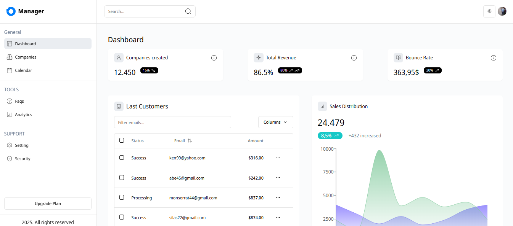

# Dashboard Administrativo



## Descripción

Este proyecto es un Dashboard Administrativo diseñado para proporcionar una visión general de los métricos de rendimiento de las empresas y otros indicadores clave. Permite a los usuarios agregar, editar y eliminar empresas, así como ver y exportar datos de rendimiento.

## Características

- **Visión General del Rendimiento**: Proporciona métricos clave y gráficos de rendimiento.
- **Gestión de Empresas**: Permite agregar, editar y eliminar empresas.
- **Exportación de Datos**: Los usuarios pueden exportar datos en varios formatos.
- **Filtros y Ordenación**: Facilita la búsqueda y organización de datos.

## Tecnologías Utilizadas

- **Next.js 14**: Framework de React para aplicaciones web.
- **TypeScript**: Lenguaje de programación que extiende JavaScript.
- **Tailwind CSS**: Framework de CSS para un diseño rápido y responsivo.
- **Prisma**: ORM para bases de datos.
- **FullCalendar**: Biblioteca de JavaScript para calendarios interactivos.
- **Recharts**: Biblioteca de gráficos para React.

## Instalación

Primero, clona el repositorio:

```bash
git clone https://github.com/tu-usuario/dashboard-companies.git
cd dashboard-companies
```

## Instala las dependencias

```bash
npm install

yarn install

pnpm install

bun install
```

## Levantar proyecto en Local

```bash
npm run dev

yarn dev

pnpm dev

bun dev
```

Abre http://localhost:3000 en tu navegador 